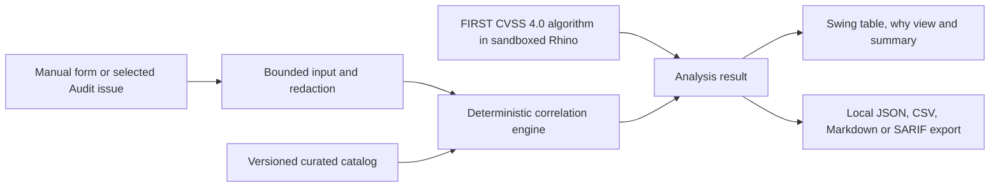

# Architecture

Burp Framework Mapper is a single offline Java 21 extension. Montoya is a
`provided` API boundary; the packaged JAR contains project code, Jackson,
Rhino, the curated catalog, its source manifest and FIRST's reference CVSS
JavaScript. The catalog includes a dedicated `Digital Assets / Web3` boundary
for the project-curated MITRE AADAPT subset; AADAPT data is bundled at build
time and is never fetched by the running extension.

## Boundaries

- `BurpFrameworkMapperExtension` registers one suite tab and a context-menu
  provider. It does not register HTTP handlers, scanners, proxy listeners or
  background network clients.
- `BurpIssueImporter` is the only Montoya-to-domain adapter. It deliberately
  accesses six summary fields and never calls `requestResponses()` or
  `collaboratorInteractions()`.
- `FindingInput`, `AnalysisResult` and `CorrelationResult` are immutable records.
- `CorrelationEngine` has no I/O. It evaluates exact CWE/identifier matches and
  reviewed phrases, enforces surface boundaries, scores signals, deduplicates
  and orders output.
- MITRE AADAPT rows use `CONTEXTUAL_ENABLEMENT` and are inferred only on the
  `Digital Assets / Web3` surface. They describe possible digital-asset threat
  context and never assert that a technique was observed or performed.
- `Cvss40Calculator` accepts one bounded canonical vector, disables Rhino Java
  class visibility and invokes only the project wrapper around FIRST's reference
  algorithm.
- Exporters serialize one schema-versioned `AnalysisReport`. `SafeFileWriter`
  requires an existing directory, rejects symlink targets and uses an atomic
  move where supported.

## Threading

Swing components are created and mutated on the Event Dispatch Thread. Analysis
runs in `SwingWorker.doInBackground()` and publishes an immutable result when
complete. Catalog loading and CVSS source assembly happen without network I/O.

## Packaging

Maven Shade creates one loadable JAR. Montoya remains `provided` and a separate
verification script fails if `burp/api/montoya/` is present. CycloneDX creates
JSON and XML SBOMs. The JAR also embeds the AADAPT attribution and terms notice.
The runtime does not self-update; catalog changes are source changes reviewed
and released through the normal CI path.
